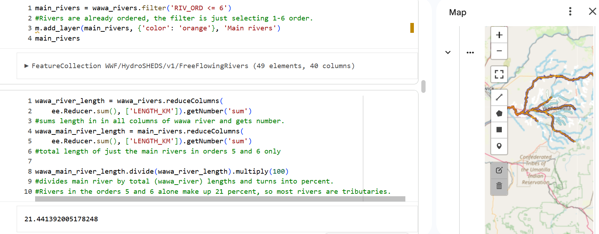
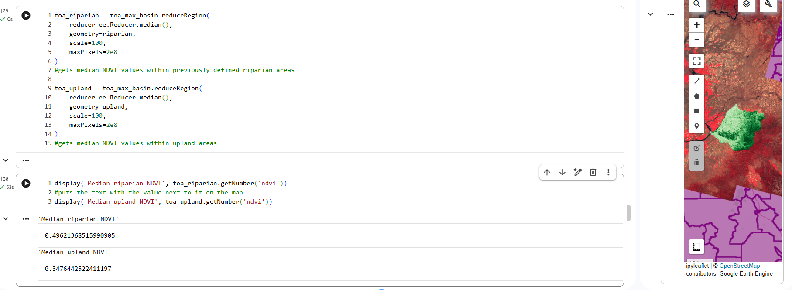

## Interactive Dashboards & Web GIS Applications
**Power BI • ArcGIS Experience Builder • Custom Web Mapping**

This section documents applied geospatial projects focused on **interactive analysis, data-driven decision support, and cartographic design**. Projects range from full dashboard applications to independent web mapping and basemap development work.

🔗 **Extended ArcGIS Portfolio (Esri Hub)**  
A consolidated portfolio of additional visualization-focused projects developed in ArcGIS Experience Builder, ArcGIS Dashboards, and extensive use of Arcade advanced pop-up scripting.
👉 View the full Esri Hub portfolio: https://csulb.hub.arcgis.com/pages/b82842670730436991cf08f8b023501a?preview=true

---

### 📊 Project 1: Interactive Restaurant Analysis Dashboard  
**Power BI · ArcGIS Experience Builder · Survey123**

🔗 **Live Applications**  
- **Power BI Dashboard:** [View Interactive Dashboard](https://app.powerbi.com/groups/me/reports/dfd5324f-eff7-4a38-ac2f-d07c83833f84/9b943d3431319454036d?experience=power-bi)  
- *Web GIS Application (Experience Builder):* [Open Web App](https://csulb.maps.arcgis.com/home/item.html?id=f1858b7291a74810b991c77a5711407f)
- *Survey123 Form:* [Submit / View Survey](https://csulb.maps.arcgis.com/home/item.html?id=e67d65f4376440c0b955b1871b9a5dfd)

**Overview**  
This project integrates Yelp restaurant review data with user-submitted Survey123 responses to support comparative spatial and qualitative analysis. The system consists of a Power BI dashboard, an ArcGIS Experience Builder web application, and a Survey123 form. Power BI serves as the primary analytical interface, while Experience Builder extends spatial exploration beyond the constraints of a dashboard layout.

#### **Application Components**

**Power BI Dashboard (Primary Analysis Interface)**  


**ArcGIS Experience Builder Web App (Extended Spatial Exploration)**  


**Survey123 Form (User Data Collection)**  


#### **Role of ArcGIS Experience Builder**
The ArcGIS Experience Builder application provides deeper spatial interaction beyond the Power BI dashboard. Each restaurant point includes a structured pop-up that integrates both **user-submitted survey responses** and **aggregated Yelp review data**.

Within the pop-up:
- The **“Experience”** and **“Write a Review”** sections display Survey123 responses, allowing users to view qualitative feedback and contribute new survey entries.
- Below the survey content, **Yelp review data** is presented, including aggregated ratings and review metrics derived from online sources.

#### **Key Design Decisions**
- The dashboard is intentionally divided into two vertical sections:
  - **Top section:** Aggregated Yelp-based metrics (map, charts, summary cards)
  - **Bottom section:** Survey submissions and survey-derived summaries
- Survey data is kept distinct from aggregated Yelp statistics to avoid conflation while still supporting comparison.
- The Experience Builder application links Yelp and survey data through a shared restaurant name identifier, enabling map pop-ups to display both qualitative survey feedback and aggregated Yelp review information.

#### **Core Features**
- Interactive map displaying restaurant locations  
- Bar charts summarizing average Yelp ratings by restaurant  
- Summary cards showing counts and overall averages  
- Survey response table with user-submitted ratings and comments  
- Dropdown slicer for filtering Yelp reviews by rating class  
- Linked web mapping application for extended spatial interaction  

#### **Rating Class Dropdown (DAX Implementation)**
To support categorical filtering of continuous Yelp ratings, a calculated **Rating Class** field was created and applied as a dropdown slicer. Selecting a rating class dynamically filters the map, bar charts, and summary cards simultaneously.

```DAX
RatingClass =
SWITCH(
    TRUE(),
    [YelpRating] >= 4.7, "4.7+",
    [YelpRating] >= 4.5, "4.5 – 4.69",
    [YelpRating] >= 4.4, "4.4 – 4.49",
    [YelpRating] >= 4.0, "4.0 – 4.39",
    "Below 4.0"
)
```
#### **Technical Highlights**
- ArcGIS Map for Power BI used in place of Azure Maps for greater GIS functionality  
- Consistent color usage across visuals to reinforce meaning  
- Bold axis labels and external bar values for readability  
- Cleaned and validated Excel source data to ensure reliable pop-ups and hyperlinks  
- Standardized field names across Power BI and ArcGIS Online for seamless integration  
- Experience Builder widgets configured to maintain usability across different screen sizes  

#### **Tools**
- Power BI Desktop  
- ArcGIS Online  
- ArcGIS Experience Builder  
- ArcGIS Survey123  
- Excel (data cleaning and validation)

---

### 🗺️ Project 2: Olympic Venues & Transportation Flow  
**Custom ArcGIS Vector Basemap Design**

🔗 **Web Map (Item Page):** [Open Web Map Item](https://www.arcgis.com/home/item.html?id=a84a149775b0419e90808eceb19bc8c5)
*If the live map is temporarily unavailable due to network or ArcGIS Online service issues, a static preview is shown below.*

**Overview**  
This project focuses on custom **vector basemap design** using ArcGIS Online’s **Vector Tile Style Editor**. The goal was to create a basemap that supports thematic Olympic venue data while maintaining visual restraint, clear hierarchy, and legibility across scales. Rather than relying on a default basemap, the styling was intentionally modified to reduce visual noise and emphasize transportation connectivity.


#### **Cartographic Design Strategy**
- Light and dark blue tones were applied to **water features and major highways** to establish visual continuity and highlight circulation patterns.
- Road widths and label font sizes were reduced to prevent the basemap from overpowering thematic layers.
- Yellow halos were added around place names to improve label legibility against varied backgrounds.
- Parks were symbolized in dark green and spatially softened to act as accents rather than dominant visual elements.

#### **Thematic Layer Design**
- Olympic venue locations are symbolized in **red**, immediately distinguishing them from the basemap.
- Red venue points complete a balanced Olympic-inspired color palette consisting of **red, green, blue, black, and white**.
- Blue polygons were added around venues to reinforce visibility and contrast across multiple zoom levels.
- Highway styling emphasizes how regional transportation corridors feed into venue locations, supporting spatial interpretation of accessibility.

#### **Design Intent**
The basemap was designed to function as a supporting structure rather than a focal element. Color, symbol weight, and spacing were deliberately restrained so that Olympic venues and transportation relationships remain visually prominent without distraction from underlying geographic context.

#### **Tools**
- ArcGIS Online  
- ArcGIS Vector Tile Style Editor  

#### **Focus**
Cartographic design, vector basemap styling, visual hierarchy, and thematic support mapping.

---

## 🌊 Project 3: Geoprocessing & Remote Sensing Analysis with Google Earth Engine (Python)

**Python · Google Earth Engine · geemap · Landsat 9**

This project demonstrates an end-to-end **geoprocessing and remote sensing workflow** implemented with the **Google Earth Engine Python API** (`geemap`). The analysis integrates **vector and raster processing**, spatial filtering, attribute queries, and vegetation index analysis within the **Walla Walla Basin (Washington, USA)**.

The workflow emphasizes reproducible Python scripting, spatial reasoning, and analytical decision-making, transitioning from hydrologic network analysis to raster-based environmental assessment.

### Overview

Global hydrologic datasets and satellite imagery were combined to examine **river structure, riparian extent, and vegetation patterns** across the Walla Walla Basin. Vector operations were used to isolate basin-specific river segments, derive spatial relationships, and define analytical zones, while raster processing supported vegetation index calculation and zonal comparison between riparian and upland areas.

This project highlights **programmatic geoprocessing logic** rather than interface-driven GIS tools, demonstrating how large geospatial datasets can be queried, transformed, and analyzed using Python.

📄 The complete geoprocessing workflow is implemented in the Python script  
[gee_geoprocessing_workflow_ZG.py](gee_geoprocessing_workflow_ZG_v2.py), which documents the full vector and raster analysis using the Google Earth Engine Python API.

### Vector Analysis & Spatial Operations

Vector workflows focused on hydrologic structure and spatial relationships and included:

- Loading global and national datasets:
  - WWF HydroATLAS Basin Level 6
  - WWF HydroSHEDS Free-Flowing Rivers
  - FAO GAUL administrative boundaries
- Defining a study reference point (central Walla Walla)
- Filtering basin features by attribute (`HYBAS_ID`)
- Spatial filtering using:
  - Basin intersection
  - Proximity (distance-based queries)
- Querying river attributes by stream order
- Calculating total and main-channel river lengths
- Generating riparian buffers around dominant channels
- Delineating upland areas using geometric difference operations
- Adding derived attributes (distance to study point)
- Performing spatial joins with U.S. Census Tracts (TIGER/2020)

### River Order Classification and Main Channel Selection

River segments within the Walla Walla Basin were classified by **stream order (`RIV_ORD`)** to distinguish dominant hydrologic channels from smaller tributaries. The map below highlights river segments filtered to **stream orders ≤ 6**, which were defined as *main rivers* for downstream geoprocessing.

<p align="center">
  
</p>

This classification step was required to:
- Focus riparian analysis on primary flow corridors  
- Prevent minor tributaries from disproportionately influencing buffer and zonal statistics  
- Establish a consistent hydrologic foundation for raster-based analysis  

Using this filtered network, river length statistics showed that **higher-order rivers account for approximately 21% of total river length**, indicating that most of the basin’s network consists of lower-order tributaries.

### Raster Analysis & Remote Sensing

Raster workflows were conducted using **Landsat 9 TOA imagery** and included:

- Image collection filtering by:
  - Date range (April–November 2022)
  - Basin geometry
  - Cloud cover threshold
- False-color visualization for vegetation interpretation
- Spectral index calculation:
  - Normalized Difference Vegetation Index (NDVI)
  - Normalized Burn Ratio (NBR)
- Mapping index calculations across an image collection
- Pixel-wise compositing to generate a **maximum NDVI composite**
- Clipping raster outputs to basin boundaries
- Zonal statistics comparing riparian and upland regions

#### NDVI Maximum Composite (Clipped to Basin)

The maximum NDVI composite emphasizes areas of persistent vegetation vigor by retaining the highest NDVI value observed at each pixel across the image collection.

<p align="center">
  
</p>

Higher NDVI values are concentrated along riparian corridors and irrigated agricultural areas, while lower values dominate surrounding upland and semi-arid regions. This composite served as the raster foundation for riparian versus upland comparison.

### Sampling & Exploratory Data Analysis

To support quantitative interpretation beyond map visualization, **1,000 random pixels** were sampled from the basin-clipped NDVI composite and analyzed using Pandas and Altair.

<p align="center">
  
</p>

The histogram illustrates the distribution of NDVI values across the basin, while the scatterplot compares **red (Band 4)** and **near-infrared (Band 5)** reflectance, revealing the expected spectral separation associated with vegetated surfaces. These plots confirm vegetation variability observed in the spatial analysis and provide additional context for interpreting NDVI behavior.

### Key Skills Demonstrated

- Python scripting for geospatial analysis  
- Google Earth Engine Python API  
- Vector–raster integration  
- Spatial filtering, buffering, and joins  
- Hydrologic network analysis  
- Spectral index calculation (NDVI, NBR)  
- Zonal statistics and raster sampling  
- Reproducible geoprocessing workflows  
- Exploratory spatial data analysis  

### Tools

- Python  
- Google Earth Engine  
- geemap  
- Pandas  
- Altair  

### Context

This project represents an **analytical, scripting-focused complement** to the visualization- and application-driven projects presented elsewhere in this repository. While other projects emphasize dashboards, web GIS, and cartographic design, this workflow highlights **geoprocessing logic, spatial analysis, and environmental interpretation** using programmatic GIS methods.
